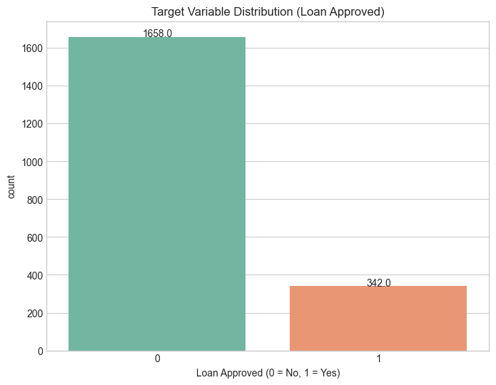
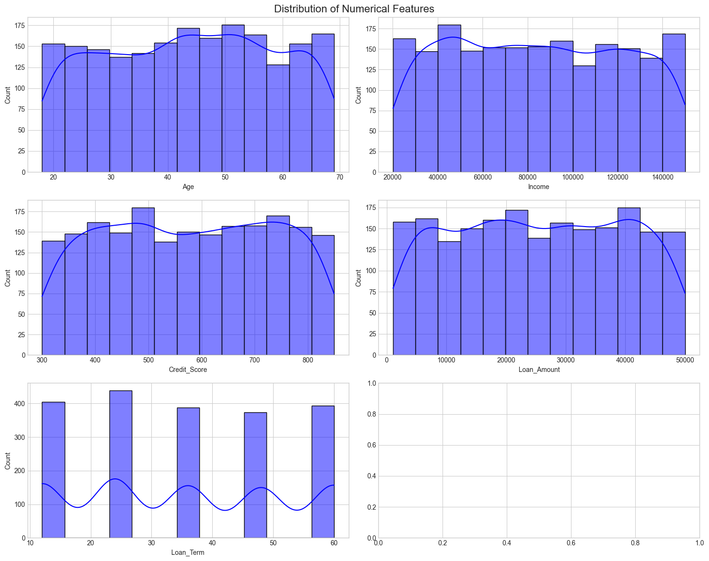
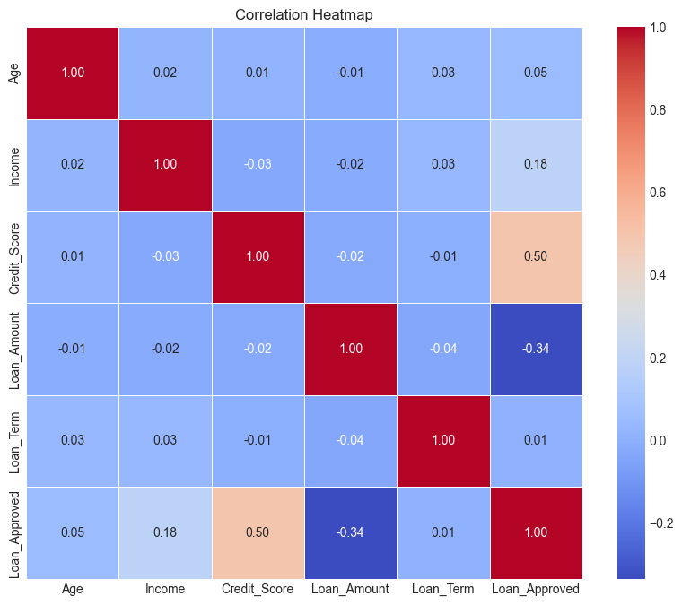
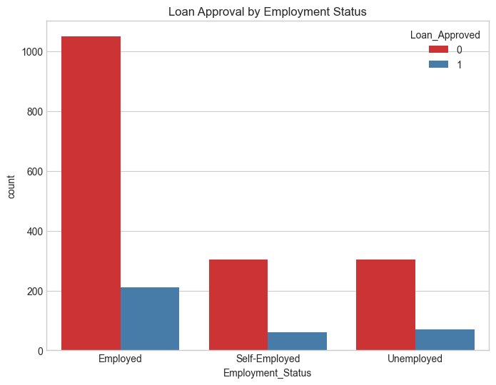
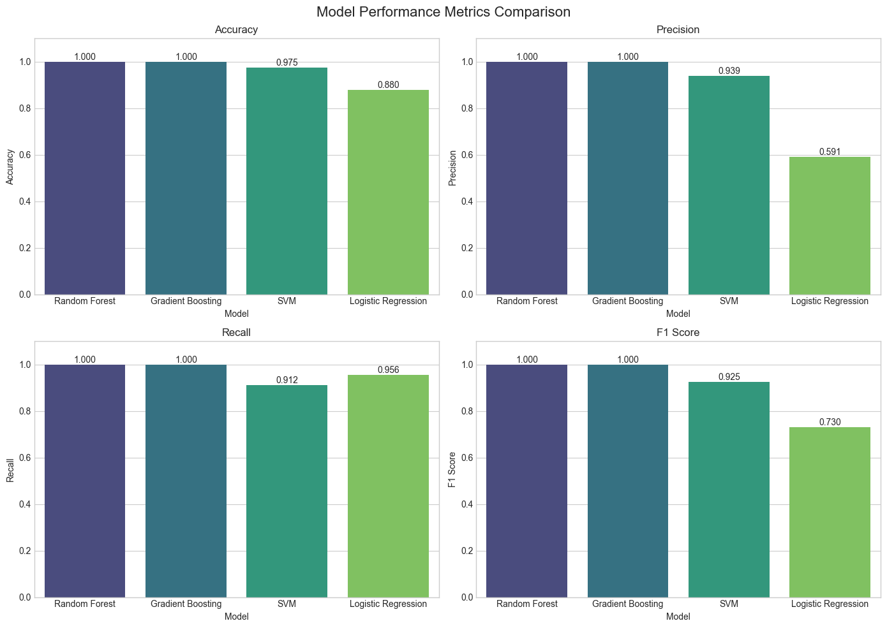
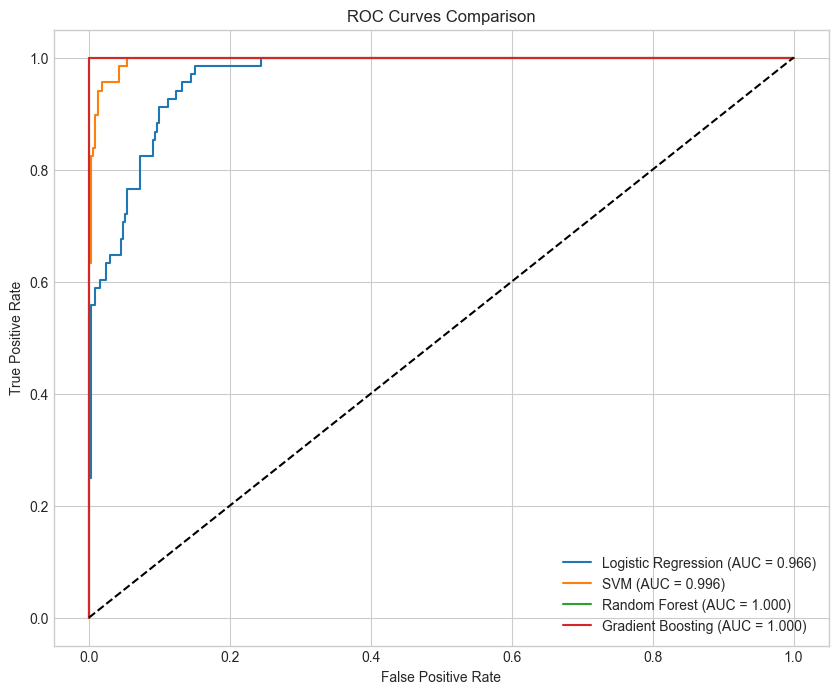
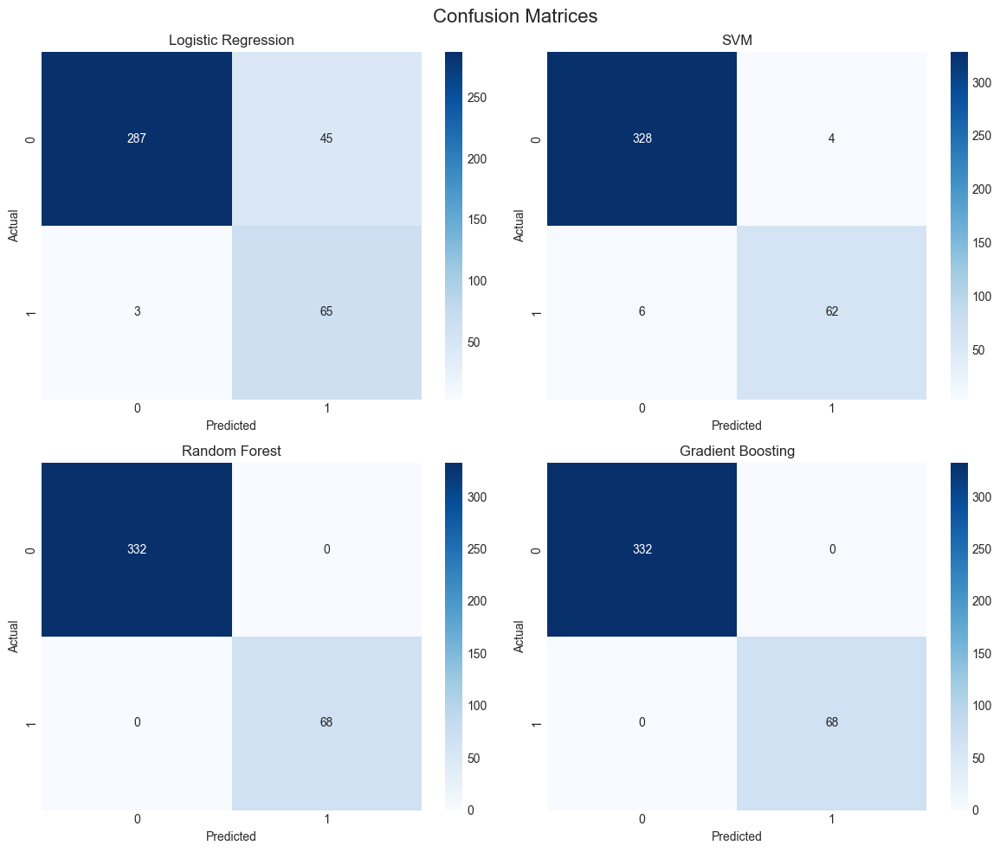
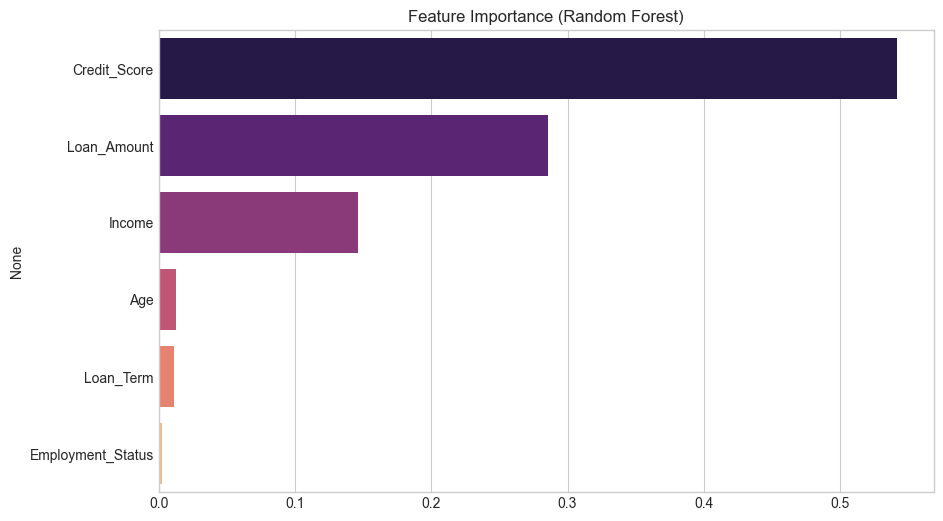

# 1. Abstract 

This report presents a complete Machine Learning based Loan Approval Prediction system developed using classification algorithms including Logistic Regression, Support Vector Machine (SVM), Random Forest, and Gradient Boosting. The project focuses on predicting whether a customer loan application will be approved or rejected based on customer-related features such as age, income, credit score, loan amount, loan term, and employment status. The study includes data preprocessing, exploratory data analysis, handling class imbalance using SMOTE, model training, hyperparameter tuning, and detailed performance evaluation.

# 2. Dataset Overview 

| Dataset Name         | Loan Prediction Dataset                           |
|----------------------|---------------------------------------------------|
| Total Records        | 2000                                              |
| Total Features       | 7                                                 |
| Numerical Features   | Age, Income, Credit_Score, Loan_Amount, Loan_Term |
| Categorical Features | Employment_Status                                 |
| Target Variable      | Loan_Approved                                     |
| Missing Values       | No Missing Values                                 |
| Class Distribution   | Loan Approved: 342, Loan Rejected: 1658           |

The dataset contains both numerical and categorical attributes associated with customer loan applications. The target variable is binary where 1 represents loan approval and 0 represents rejection.

# 3. Exploratory Data Analysis (EDA) 

Exploratory Data Analysis was performed to understand the structure, relationships, and distributions present in the dataset. Various visualization techniques were used to identify patterns and important insights.

## 3.1 Target Variable Distribution 

The dataset is highly imbalanced as the number of rejected loan applications is significantly higher than approved loans. To solve this issue, SMOTE (Synthetic Minority Oversampling Technique) was applied during preprocessing.

## 3.2 Distribution of Numerical Features

The numerical feature distributions show that customer attributes such as age, income, credit score, and loan amount are spread across wide ranges. Credit score and income appear to play an important role in loan approval decisions.

## 3.3 Correlation Analysis 

The correlation heatmap indicates that Credit Score has the strongest positive correlation with loan approval (0.50), while Loan Amount shows a negative correlation (-0.34). This suggests that higher credit scores increase approval chances whereas larger loan amounts reduce approval probability.

## 3.4 Loan Approval by Employment Status 

Employed customers received comparatively more approvals than unemployed or self-employed applicants. Employment status therefore acts as an important categorical feature.

# 4. Data Preprocessing and Feature Engineering 

- Duplicate records were removed.

- Missing numerical values were filled using median imputation.

- Missing categorical values were handled using mode imputation.

- Categorical variables were encoded using Label Encoding.

- Feature Scaling was performed using StandardScaler.

- Dataset imbalance was handled using SMOTE.

- Train-test split was performed for model validation.

# 5. Machine Learning Models Used

**Logistic Regression:** A linear classification algorithm used as the baseline model.

**Support Vector Machine (SVM):** A supervised learning algorithm that finds the optimal decision boundary.

**Random Forest:** An ensemble learning algorithm based on multiple decision trees.

**Gradient Boosting:** A boosting-based ensemble model that improves prediction accuracy sequentially.

# 6. Model Evaluation and Performance Analysis 

The comparison graph demonstrates that Random Forest and Gradient Boosting achieved perfect performance with 100% accuracy, precision, recall, and F1-score. SVM also produced excellent results with 97.5% accuracy, while Logistic Regression performed comparatively lower with 88% accuracy.

## 6.1 ROC Curve Analysis 

ROC curves indicate the ability of the model to distinguish between approved and rejected loans. Random Forest and Gradient Boosting achieved an AUC score of 1.0, indicating perfect classification performance.

## 6.2 Confusion Matrix Analysis 

The confusion matrices show prediction correctness for each model. Random Forest and Gradient Boosting classified all test samples correctly without any false predictions.

# 7. Feature Importance Analysis 

Feature importance analysis from Random Forest shows that Credit Score is the most influential feature for loan approval prediction, followed by Loan Amount and Income. Age and Loan Term had minimal impact.

# 8. Final Model Comparison Table 

| Model               | Accuracy | Precision | Recall | F1 Score | AUC   |
|---------------------|----------|-----------|--------|----------|-------|
| Random Forest       | 1.000    | 1.000     | 1.000  | 1.000    | 1.000 |
| Gradient Boosting   | 1.000    | 1.000     | 1.000  | 1.000    | 1.000 |
| SVM                 | 0.975    | 0.939     | 0.912  | 0.925    | 0.996 |
| Logistic Regression | 0.880    | 0.591     | 0.956  | 0.730    | 0.966 |

# 9. Conclusion 

This project successfully implemented multiple Machine Learning algorithms for loan approval prediction. Among all evaluated models, Random Forest and Gradient Boosting produced the best performance with perfect classification accuracy. The results also highlight the importance of Credit Score, Loan Amount, and Income in determining loan approval status. The developed system can assist financial institutions in automating loan approval decisions efficiently and accurately.

# 10. Future Scope

- Use larger real-world banking datasets.

- Implement Deep Learning models for advanced prediction.

- Deploy the model as a Flask or Streamlit web application.

- Integrate explainable AI techniques for transparency.

- Use real-time customer and financial data.
